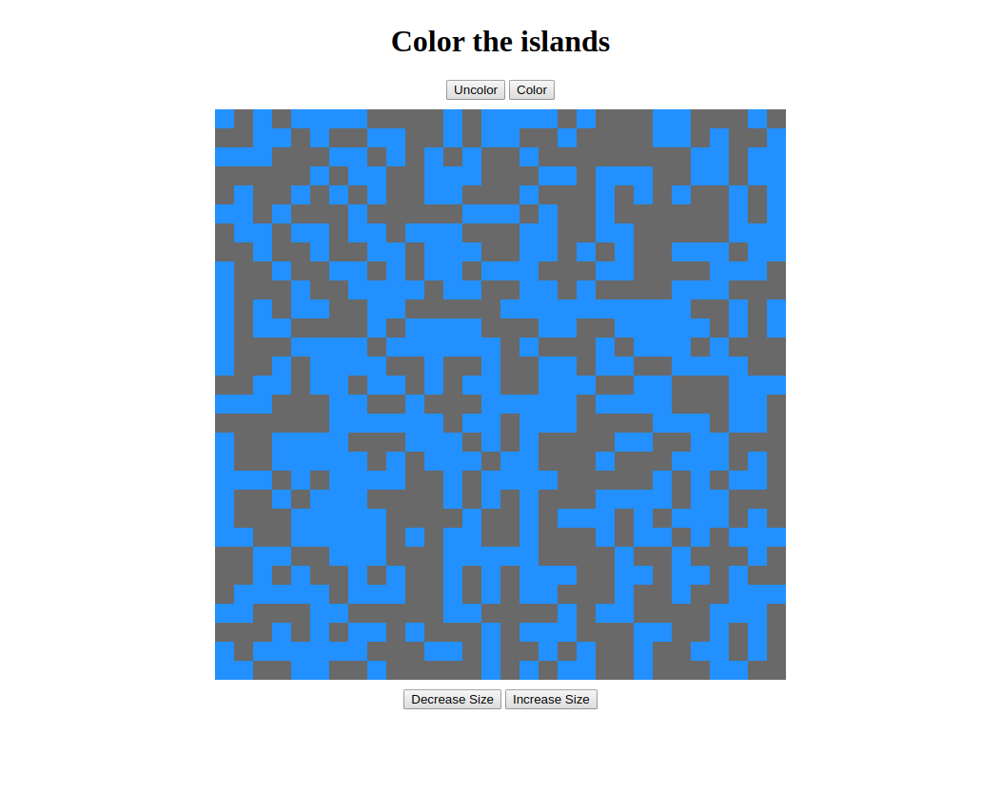
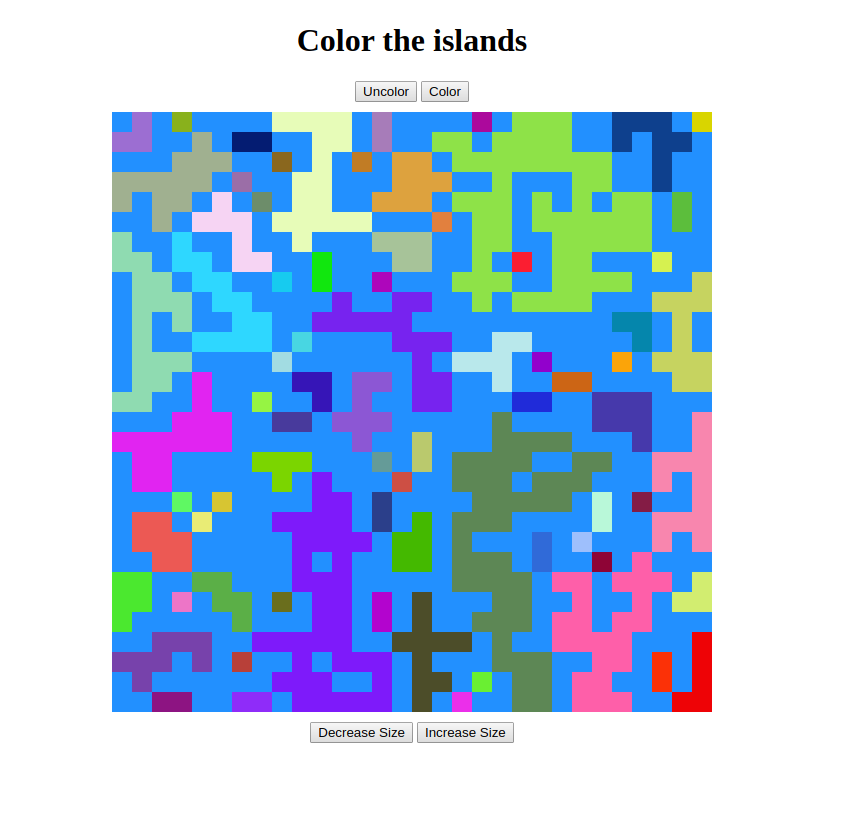

# Instructions

## Description

You have a 2 dimentional map with a certain height and width. At coordinates x, y the map can be either earth or water.

An island is a contiguous group of earth coordinates. For instance in the following map there is an island at the top left corner and one at the bottom right:

EARTH | EARTH | WATER

WATER | WATER | EARTH

WATER | EARTH | EARTH

Two earth coordinates in diagonal are not considered from the same island.

## Algorithm

Initially all earth coordinates are colored in dark grey.

You can play decreasing and increasing size to see the effect.

So far the color and uncolor buttons have no effect, that's what you're gonna change!

Find a simple algorithm to color all islands with a different color.

Basically you should see something like that in the end

## Implementation

Modify the code to implement your algorithm.

You'll find a random color generator with the method `generateRandomColor`.

The edge case where the generated color is the same as a previously generated color is not to be taken into account.
